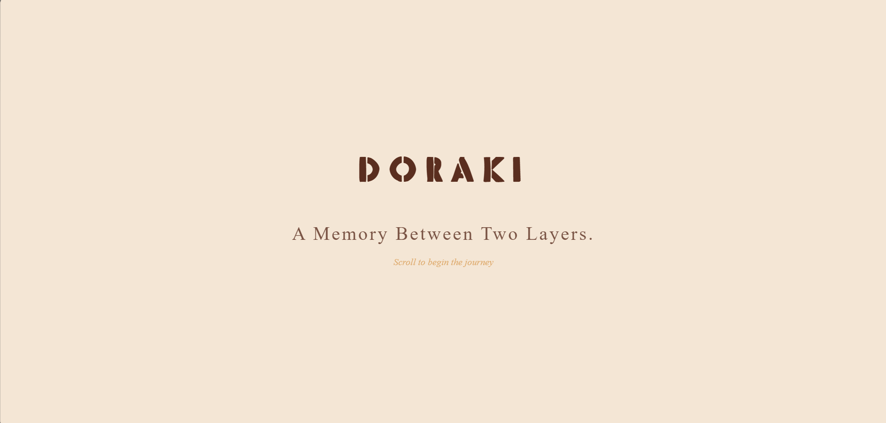
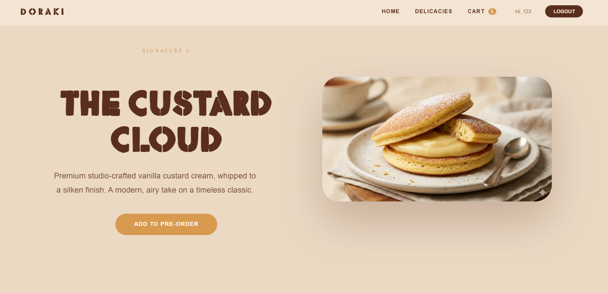
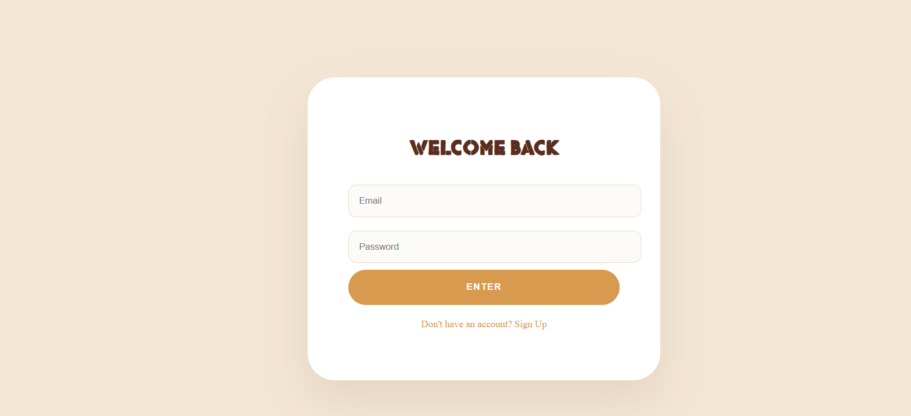

# 🍡 DORAKI - A Nostalgic Dessert Startup

**Bridging Japanese tradition with the heart of Indian nostalgia.**

Doraki is a cinematic, interactive platform built for a premium dessert brand. Built as an entrepreneurship project, it features a gamified ordering flow and a cloud-synced cart system designed with a minimalist, "paper-sketch" aesthetic.

---

## 🏗 Architecture Diagram
The application follows a modern serverless architecture, leveraging React for the view layer and Firebase for real-time data persistence.


---

## 🛠 Tech Stack

* **Frontend**: React 18, TypeScript, Vite
* **Animations**: GSAP (GreenSock Animation Platform) & ScrollTrigger
* **Backend**: Firebase Firestore (NoSQL) & Authentication
* **Styling**: Custom CSS with Glassmorphism and Cinematic storytelling focus
* **Deployment**: Vercel

---

## ✨ Features

* **Cinematic Scrolling**: High-performance GSAP animations that reveal flavor stories as you scroll.
* **Real-time Cloud Cart**: A persistent selection box that syncs instantly across devices using Firestore `onSnapshot`.
* **Hybrid Routing**: Protected routes for Cart and Collection with automatic session-based redirection.
* **Multi-Instance Logic**: Advanced cart logic allowing users to add multiple quantities of the same delicacy with independent index-based removal.

---

## 🚀 Getting Started

### Prerequisites
* Node.js (v18 or higher)
* A Firebase project with Firestore and Auth enabled

### Installation
```bash
# Clone the repository
git clone [https://github.com/your-username/doraki-startup.git](https://github.com/your-username/doraki-startup.git)

# Install dependencies
npm install
```

### Development
```bash
# Start local development server
npm run dev

# Build for production
npm run build
```
## 📸Screenshots

<p align="center">
  
  
</p>

<p align="center">
  
</p>

## 🎥Video Demo
Experience the cinematic walkthrough of the Doraki platform:
[Watch the doraki Experience on Streamable](https://streamable.com/0n6kis)

## Team Members
Hanna A
Gouri Anil

## 📜 License

This project is licensed under the [MIT License](./LICENSE) - see the LICENSE file for details.

